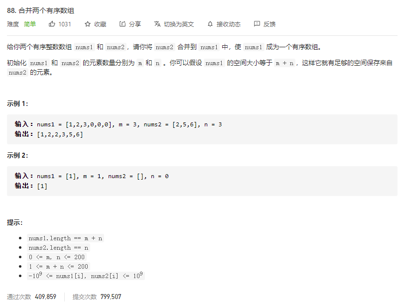
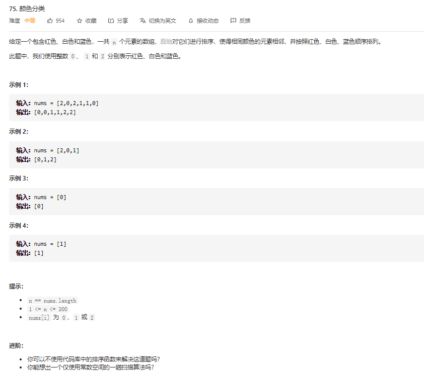
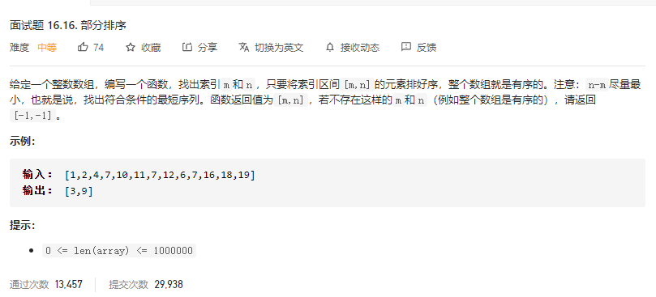

[TOC]

## 排序数组

#### [88. 合并两个有序数组](https://leetcode-cn.com/problems/merge-sorted-array/)

#### [75. 颜色分类](https://leetcode-cn.com/problems/sort-colors/)

#### [面试题 16.16. 部分排序](https://leetcode-cn.com/problems/sub-sort-lcci/)

