[TOC]

[88. 合并两个有序数组]:https://github.com/clsj/leetcode/blob/main/src/main/java/排序数组/_88_合并两个有序数组.java
[75. 颜色分类]:https://github.com/clsj/leetcode/blob/main/src/main/java/排序数组/_75_颜色分类.java
[面试题 16.16. 部分排序]:https://github.com/clsj/leetcode/blob/main/src/main/java/排序数组/_面试题_16_16_部分排序.java

## 排序数组

#### [88. 合并两个有序数组](https://leetcode-cn.com/problems/merge-sorted-array/) [代码][88. 合并两个有序数组]

#### [75. 颜色分类](https://leetcode-cn.com/problems/sort-colors/) [代码][75. 颜色分类]

#### [面试题 16.16. 部分排序](https://leetcode-cn.com/problems/sub-sort-lcci/) [代码][面试题 16.16. 部分排序]

## 链表

#### [203. 移除链表元素](https://leetcode-cn.com/problems/remove-linked-list-elements/)

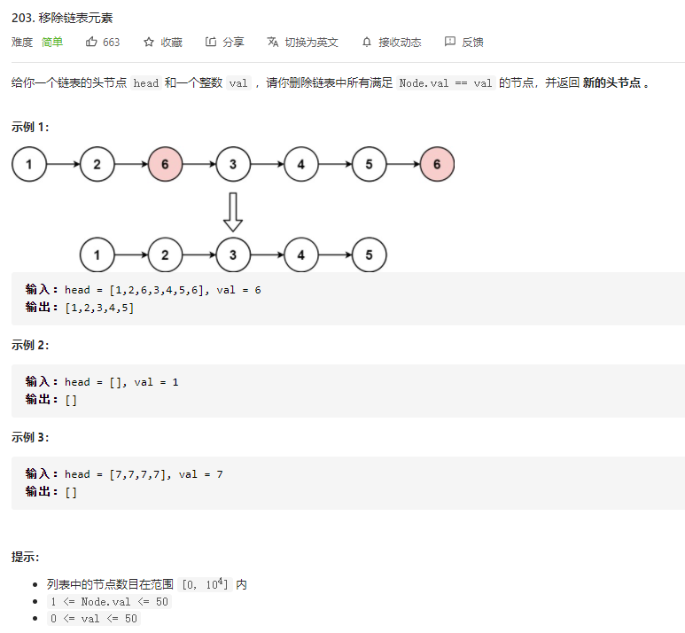

#### [2. 两数相加](https://leetcode-cn.com/problems/add-two-numbers/)

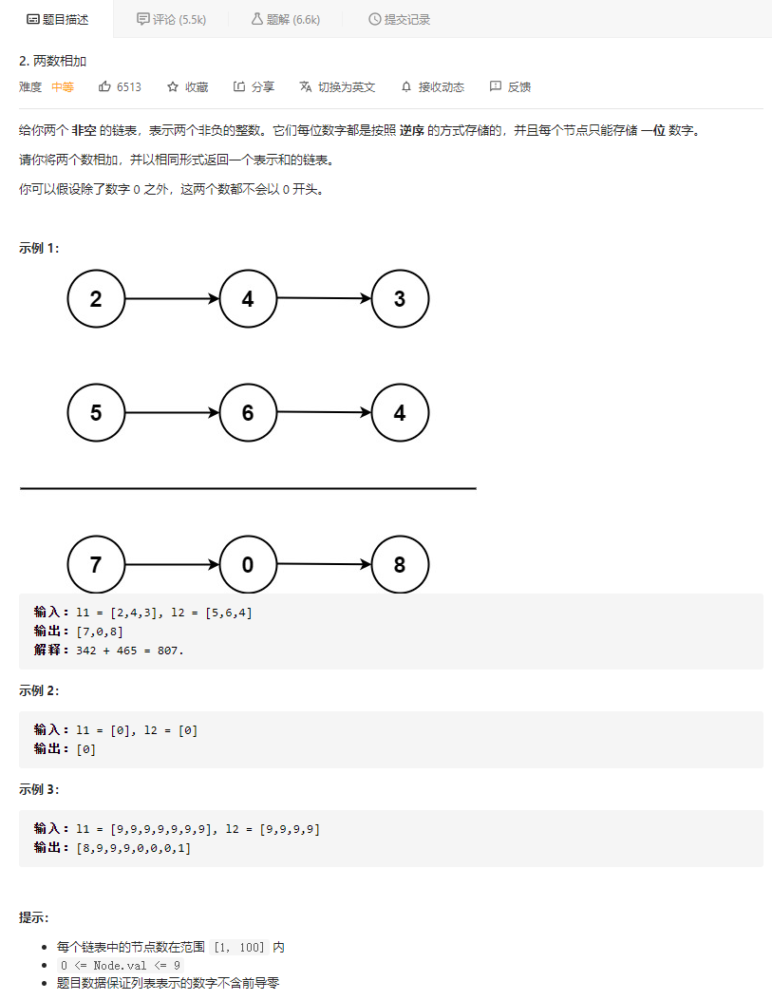

#### [160. 相交链表](https://leetcode-cn.com/problems/intersection-of-two-linked-lists/)

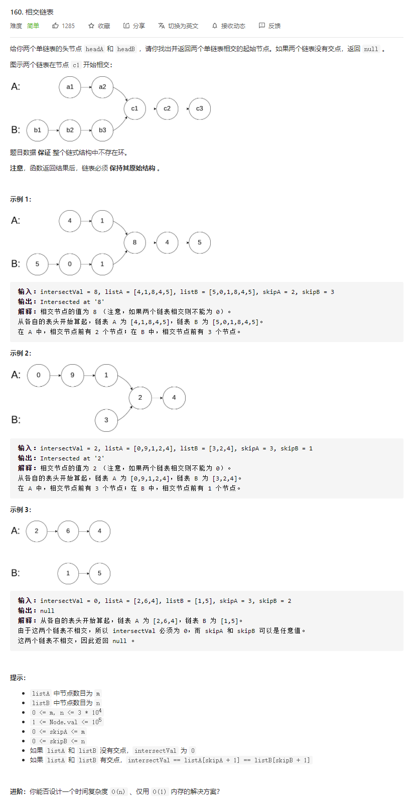

#### [86. 分隔链表](https://leetcode-cn.com/problems/partition-list/)

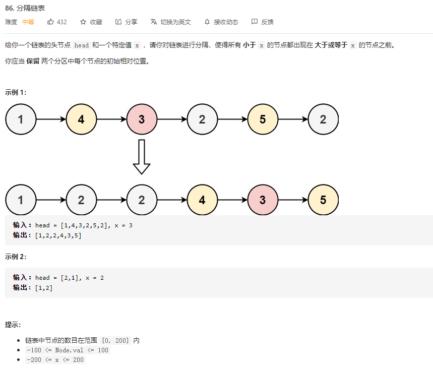

#### [234. 回文链表](https://leetcode-cn.com/problems/palindrome-linked-list/)

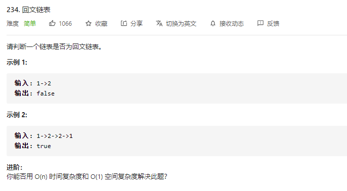

## 栈队列

#### [155. 最小栈](https://leetcode-cn.com/problems/min-stack/)

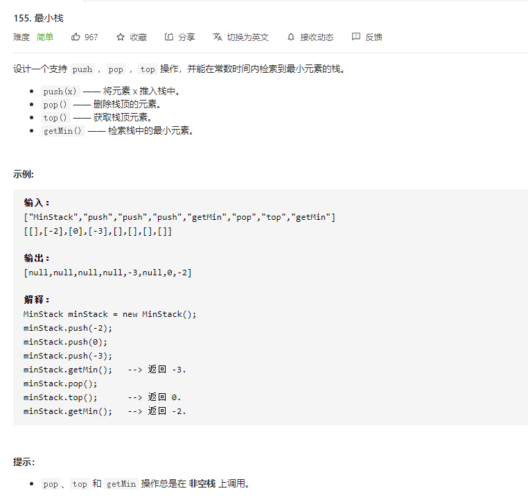

#### [239. 滑动窗口最大值](https://leetcode-cn.com/problems/sliding-window-maximum/)

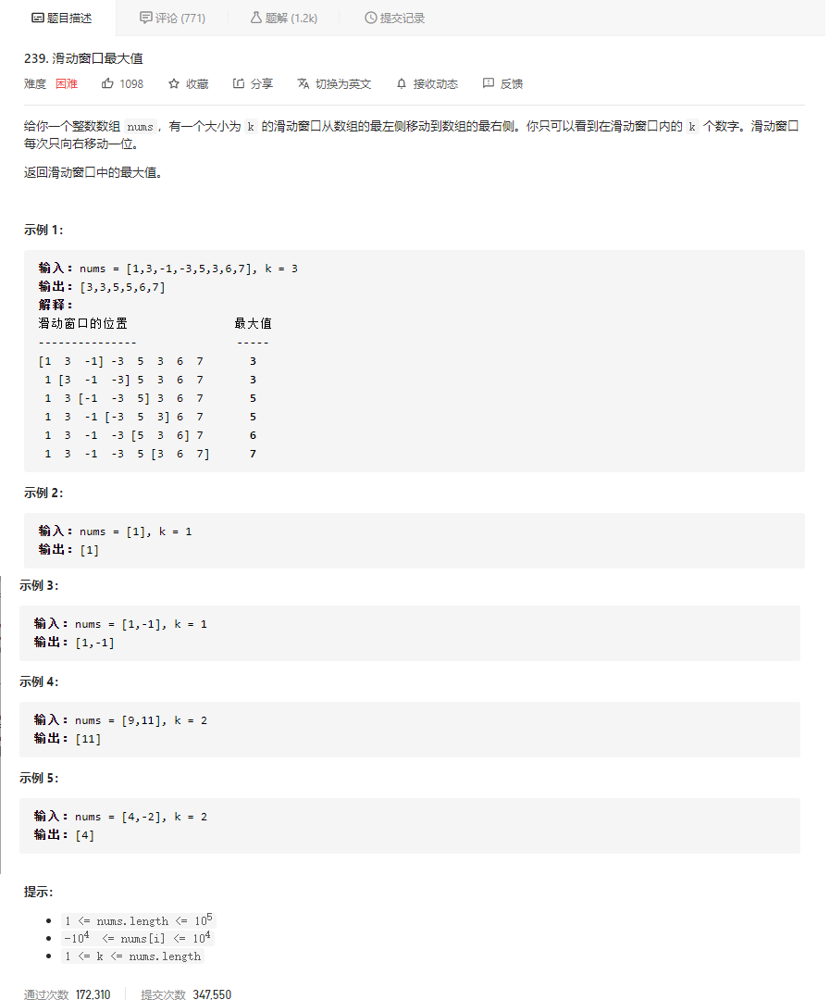

#### [654. 最大二叉树](https://leetcode-cn.com/problems/maximum-binary-tree/)

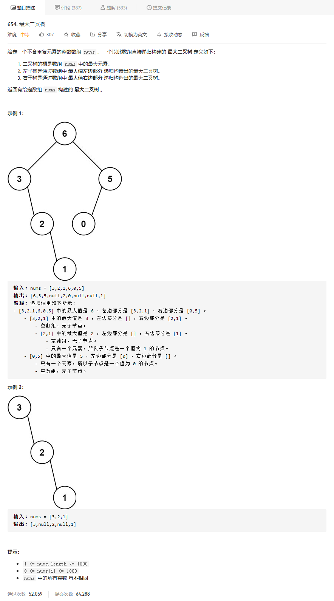

#### [739. 每日温度](https://leetcode-cn.com/problems/daily-temperatures/)

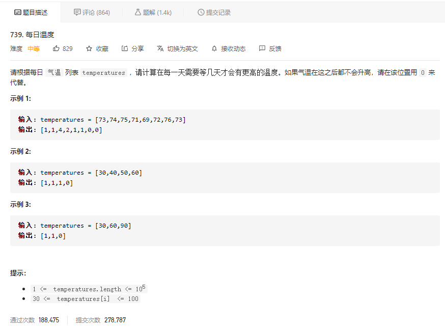

## 字符串

#### [面试题 01.09. 字符串轮转](https://leetcode-cn.com/problems/string-rotation-lcci/)

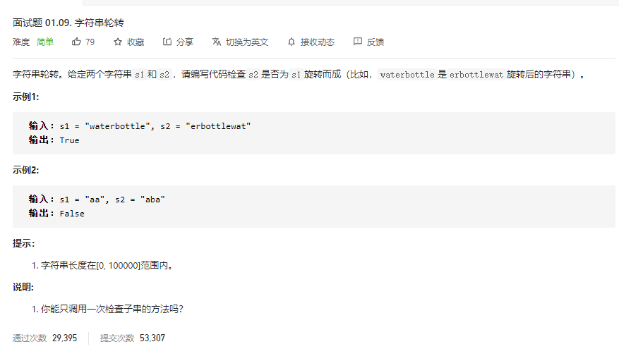

#### [572. 另一棵树的子树](https://leetcode-cn.com/problems/subtree-of-another-tree/)

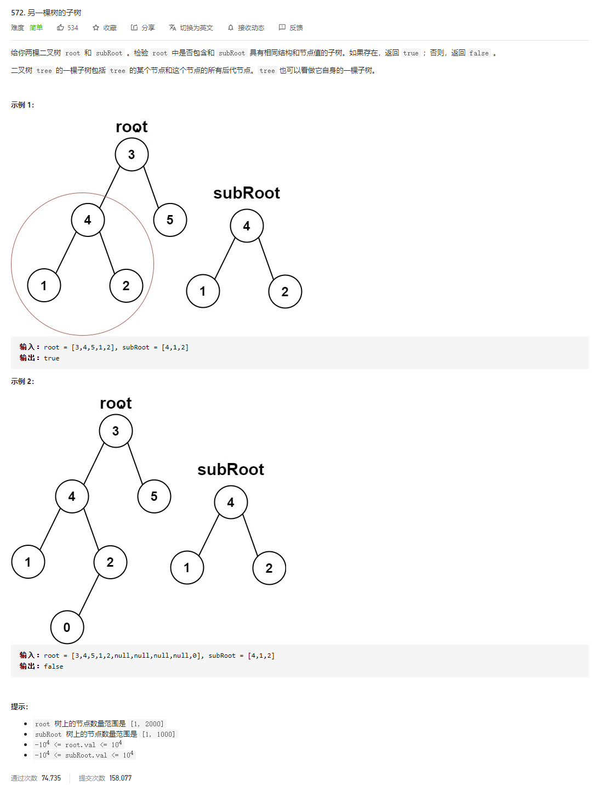

#### [242. 有效的字母异位词](https://leetcode-cn.com/problems/valid-anagram/)

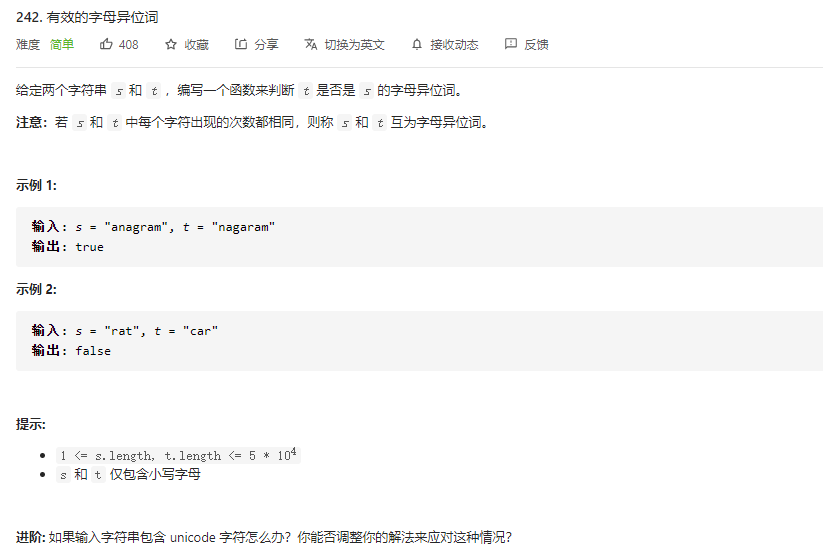

#### [151. 翻转字符串里的单词](https://leetcode-cn.com/problems/reverse-words-in-a-string/)

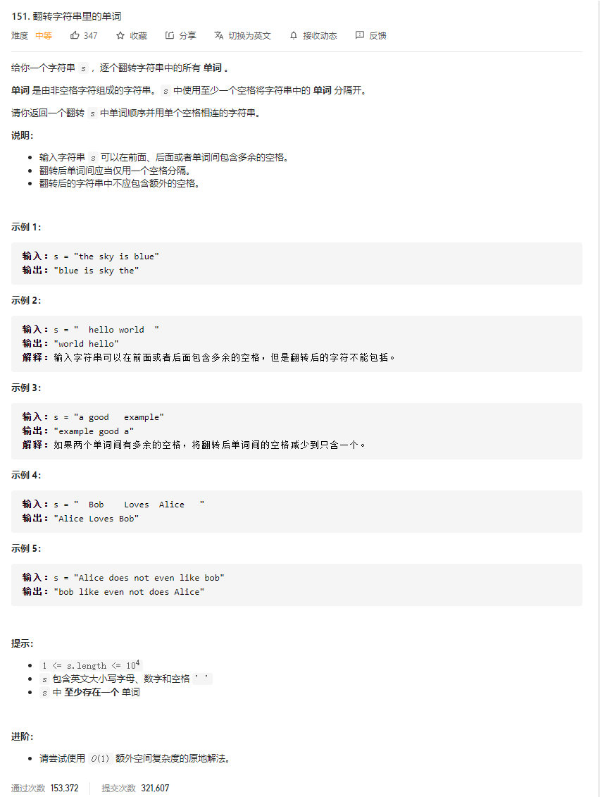

#### [3. 无重复字符的最长子串](https://leetcode-cn.com/problems/longest-substring-without-repeating-characters/)

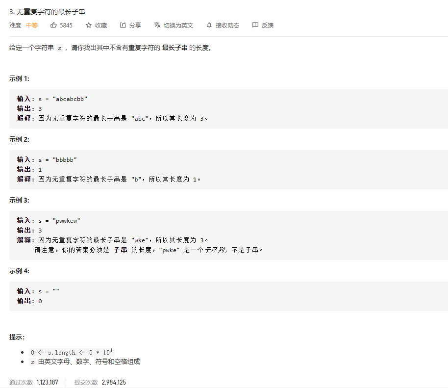

## 动态规划

#### [剑指 Offer 47. 礼物的最大价值](https://leetcode-cn.com/problems/li-wu-de-zui-da-jie-zhi-lcof/)

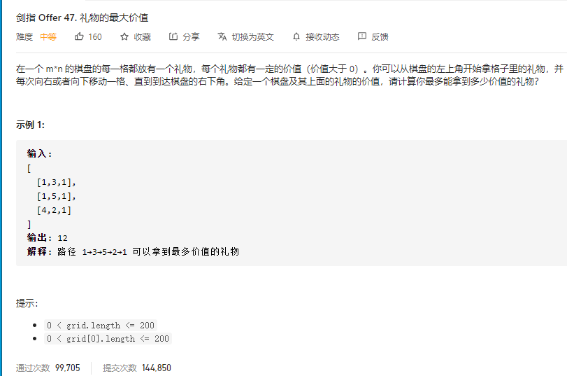

#### [121. 买卖股票的最佳时机](https://leetcode-cn.com/problems/best-time-to-buy-and-sell-stock/)

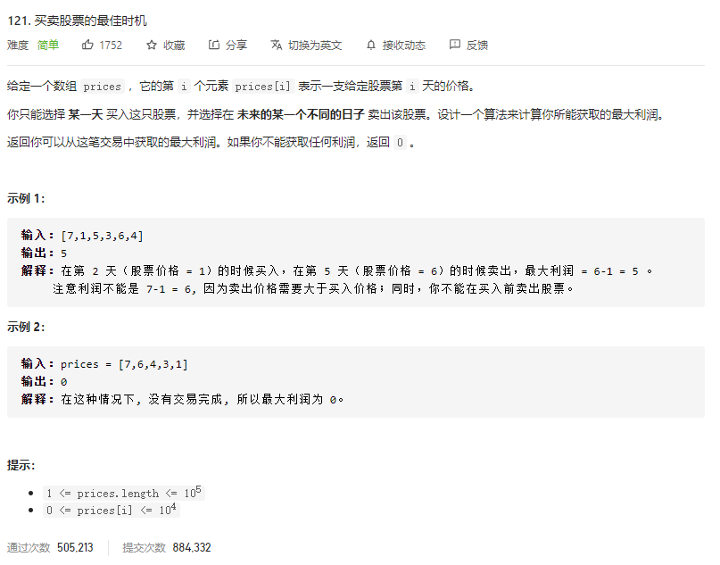
